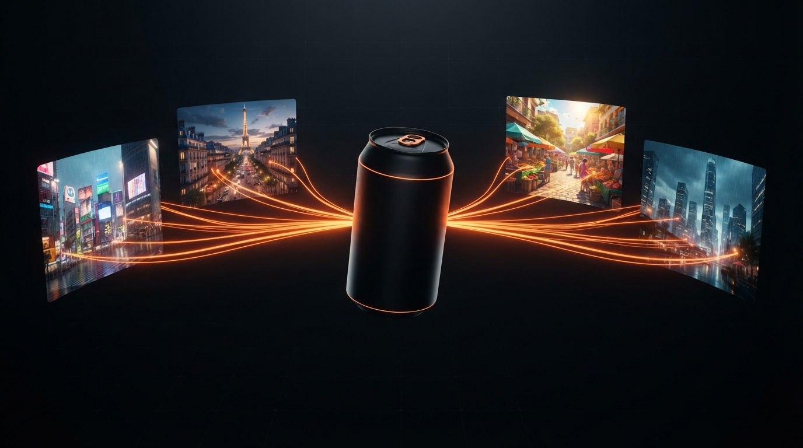

# Fan-Out Lite



A localized ad engine. Upload a product and a brief once; the system produces a
finished, localized, **narrated** video ad for each of up to **36 cities across
18 countries** in a single chained run — concept, storyboards, per-scene
animation, regional scoring, voiceover and muxing, all locked to one shared
scene bible.

Built for the DeepMind *Multimodal Creative Pipelines with GenMedia* track.

```
Upload ─▶ Concept ─▶ NB2 Lite ─▶ Omni×N (stitched) + Lyria + TTS ─▶ ffmpeg mux ─▶ Manage
(brief)   (editable    (boards)   (per-scene clips, music, voice — per market)   (master / location edit)
           idea, chat/voice)
```

The flow: **Upload** (product photos, brief, palette, markets, category, visual
style, duration slider 3–120s) → **Concept** (a creative concept is generated
from those inputs; refine it by chat or voice, then finalize) → **Storyboard**
(scenes scale with your chosen duration) → **Manage**.

## Architecture — backend and frontend fully isolated

| Layer | Stack | Location |
|---|---|---|
| **Backend** | FastAPI + `google-genai`, async orchestrator, ffmpeg | [backend/](backend/) |
| **Frontend** | React + Vite + TypeScript (5-page flow) | [frontend/](frontend/) |

The two talk over a small REST API. The **scene bible** (`runs/<id>/bible.json`)
is the single source of truth: every model call reads from and writes to it,
which is why the product, palette, beat and cut points stay identical across
markets. The frontend never writes the bible — it POSTs actions and polls the
bible ~once a second.

### The chained pipeline (each model's output feeds the next)

1. **Concept** (`gemini-3.8-flash`) turns the product photos + brief + palette +
   markets into an editable creative concept — refine it by **chat or voice**
   before anything expensive runs.
2. **Timed shot list** breaks the approved concept into scenes covering the
   full duration; scene count scales with how long the ad is (a 60s ad gets
   the classic 6-beat arc, a 6s ad gets 2).
3. **NB2 Lite** (`gemini-3.1-flash-lite-image`) generates a brand sheet, the
   master storyboard, then localized boards for every market, fanned out in
   parallel.
4. **Omni** (`gemini-omni-1.1-flash`, via the Interactions API) animates each
   storyboard scene as its own clip (Omni's real bounds are **3–10s per
   clip**), and `ffmpeg` stitches them into the full-length ad per market.
5. **Lyria** (`lyria-3.5`) scores each market in a regional style at the
   shared BPM/duration, running in parallel with video.
6. **TTS** (`gemini-3.8-flash-tts`) writes and speaks a short voiceover *in
   each market's own language*, ducked under the music.
7. Each market renders and muxes **independently** — a fast market's ad is
   playable the moment it's ready, without waiting on the slowest one.
8. A **master edit** replays one instruction across every market's ad at
   once — or, in **location edit** mode, only the market you pick.

## Verified model behavior (this endpoint)

| Model | Call shape | Result |
|---|---|---|
| Image · `gemini-3.1-flash-lite-image` | `models.generate_content`, `IMAGE` modality → JPEG | ~4.2s |
| Video · `gemini-omni-1.1-flash` | **Interactions API**, `background` + poll → mp4; **bounds 3–10s per clip** | ~40s/clip ✅ under the 60s go/no-go |
| Music · `lyria-3.5` | `models.generate_content`, `AUDIO` modality → mp3 (ignores requested duration; trimmed by ffmpeg) | ~40s |
| Voice · `gemini-3.8-flash-tts` | `models.generate_content`, `AUDIO` modality → wav, localized script written first | ~4–5s |
| Fan-out | 8 parallel images | ~6s |

End-to-end measured through the running app: full image pipeline (brand sheet +
storyboard + 12 localized boards) in **24s**; a 30s ad stitched from 3 distinct
10s scene clips → final mp4 **exactly 30.000s**; an 8s ad with a Hindi
voiceover → final mp4 **exactly 8.000s**, transcribed back to correct Hindi.

## Quick start

Requires Python 3.11+, Node 18+, and `ffmpeg` on PATH.

```bash
# 1. Backend
cd backend
cp .env.example .env        # then paste your GEMINI_API_KEY
pip install -r requirements.txt
python -m scripts.smoke_test        # optional go/no-go latency check
python -m scripts.prerender         # optional: build the demo fallback
uvicorn app.main:app --reload --port 8100
```

```bash
# 2. Frontend (second terminal)
cd frontend
npm install
npm run dev                 # http://localhost:5173  (proxies /api to :8100)
```

Or run everything on one origin: `npm run build` in `frontend/`, then just start
the backend — it serves the built SPA. `./run.sh` starts both together for
local dev (port 8100 by default; port 8000 is avoided as it's often already
taken by other tooling).

## Demo flow

Home → **Start a new campaign** → Upload photos + brief + pick markets + set
duration → **Concept** (edit by chat/voice, finalize) → **Storyboard** (watch
localized boards appear, edit a shot) → **Render** → **Manage** (play markets
side by side, timers and stage pills) → **Master edit** (propagate to every
market) or **Location edit** (change one market only). If anything fails
live, **See it in action** on Home loads the pre-rendered fallback offline.

See [backend/README.md](backend/README.md) for the API reference and internals,
and [KAGGLE_WRITEUP.md](KAGGLE_WRITEUP.md) for the full technical write-up.
