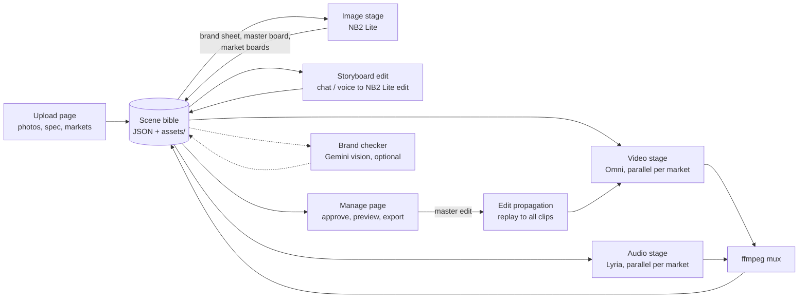

# Fan-Out Lite: Implementation Plan

**Track:** DeepMind Hackathon, Multimodal Creative Pipelines with GenMedia
**Models:** Nano Banana 2 Lite (`gemini-3.1-flash-lite-image`), Gemini Omni Flash (`gemini-omni-1.1-flash`), Lyria 3.5 (`lyria-3.5`)
**Build window:** 3 hours
**UI mockup:** https://claude.ai/artifact/SvdSee4hwdR3YSjwWADbsw

---

## 1. What we are building

Fan-Out Lite is a localized ad engine. A marketer uploads product artifacts and a brief once. The system then produces a finished, localized video ad for each of 4 markets in a single loop:

1. **NB2 Lite** generates a brand sheet, then a 6-shot master storyboard, then localized storyboards for every market in parallel.
2. The user edits the storyboard conversationally, by text or voice.
3. **Omni** animates one hero clip per market from the approved boards.
4. **Lyria** scores each market in a regional style, all locked to one shared BPM and duration.
5. ffmpeg merges video and audio.
6. One conversational **master edit** is replayed across all market clips at once.

### Why this clears the bar

| Judging bar requirement | How Fan-Out meets it |
|---|---|
| Chained pipeline, not a prompt box | 5 stages in which each model's output is the next one's input |
| High throughput is load-bearing | About 20+ images per run; the product only exists because of fan-out |
| Speed is load-bearing | A live pipeline timer is on screen; iteration happens within one meeting |
| Cross-modal continuity | A shared scene bible (palette, product refs, style, BPM) feeds every model call |
| Multi-turn conversational editing | Storyboard chat edits, plus master edits propagated to all market clips |

### Goals

- A working end-to-end run for at least 3 markets, live in the demo.
- A visible edit-propagation moment: one instruction, and every market clip updates.
- A pre-rendered fallback run that can be switched to in one click.

### Non-goals (for the 3-hour window)

- User accounts, persistence beyond local disk, and deployment to the cloud.
- More than 4 markets, or ads longer than about 8 seconds.
- Production-grade error recovery or queueing infrastructure.

---

## 2. Decisions already locked

- Scope is 1 master concept rolled out to 4 markets: go wide on images, narrow on video.
- A single JSON **scene bible** is the source of truth that every model call reads and writes.
- Lyria tracks use a fixed BPM and duration so cuts align across markets.
- ffmpeg handles merging.
- The UI is Streamlit or Gradio, with a live pipeline timer. This plan recommends Streamlit, because its multipage layout maps directly to the 4 mockup pages.
- A full run is pre-rendered as a demo fallback.
- **Go/no-go rule:** if Omni takes more than about 60 seconds per clip in the smoke test, pivot to Concept Arena.
- **Cut order if time runs short:**
  1. Brand-consistency checker.
  2. Drop to 3 markets.
  3. Skip music re-generation after edits.

---

## 3. Architecture



### Component responsibilities

| Component | Responsibility |
|---|---|
| `SceneBible` | Pydantic model, persisted as `runs/<id>/bible.json`; the single source of truth |
| `BibleStore` | Loads and saves the bible behind an `asyncio.Lock`; atomic writes |
| Model adapters | Thin wrappers per model: `ImageAdapter`, `VideoAdapter`, `MusicAdapter`, `VisionJudge` |
| `Orchestrator` | Runs stages with `asyncio.gather`, applying per-model concurrency limits, retries and timeouts |
| `EditEngine` | Stores edits as structured operations and replays them across markets |
| `Muxer` | Wraps ffmpeg to merge video and audio and normalize duration |
| Streamlit UI | 4 pages that read the bible and trigger orchestrator actions |
| `DemoMode` | Swaps the live run for the pre-rendered fallback run |

### Design principles

- **The bible is the API between people.** The UI developer can build against a fixture bible from minute 20, before any model call works.
- **Every stage is idempotent and resumable.** A stage skips any asset already marked `done`, so a crash mid-run costs only the failed calls.
- **Adapters isolate API uncertainty.** If a model's SDK shape differs from what we expect, only one file changes.

---

## 4. Tech stack

| Layer | Choice | Reason |
|---|---|---|
| Language | Python 3.11+ | The google-genai SDK and fast prototyping |
| Model SDK | `google-genai` | The official Gemini SDK; verify the exact calls in the smoke test |
| Data models | `pydantic` v2 | A typed bible with free JSON (de)serialization |
| Concurrency | `asyncio` plus `asyncio.Semaphore` | Parallel fan-out with per-model rate limits |
| Retries | `tenacity` | Exponential backoff on 429 and 5xx errors |
| Media | `ffmpeg` (CLI) plus `ffmpeg-python` or `subprocess` | Muxing and trimming |
| UI | Streamlit (multipage) | Fastest route to the 4-page flow; `st.audio_input` for voice |
| Config | `python-dotenv` | API keys and tunables |

---

## 5. Repository structure

```
fan-out/
├── .env.example
├── requirements.txt
├── README.md
├── fanout/
│   ├── __init__.py
│   ├── config.py            # env, concurrency limits, timeouts, model IDs
│   ├── bible.py             # SceneBible pydantic models + BibleStore
│   ├── markets.py           # market presets (locale, cues, music style)
│   ├── prompts.py           # prompt templates per stage
│   ├── adapters/
│   │   ├── image.py         # NB2 Lite: generate + edit
│   │   ├── video.py         # Omni: generate + edit
│   │   ├── music.py         # Lyria: generate
│   │   └── judge.py         # Gemini vision brand checker (optional)
│   ├── orchestrator.py      # stage runners, fan-out, timing
│   ├── edits.py             # EditOp + propagation engine
│   ├── mux.py               # ffmpeg helpers
│   └── demo.py              # fallback loader
├── app/
│   ├── Home.py              # Landing page
│   └── pages/
│       ├── 1_Upload.py
│       ├── 2_Storyboard.py
│       └── 3_Manage.py
├── fixtures/
│   └── bible_sample.json    # fake bible for UI dev from minute 20
├── runs/                    # live run outputs (gitignored)
│   └── <run_id>/{bible.json, images/, clips/, tracks/, final/}
├── fallback/                # pre-rendered complete run for demo
└── scripts/
    ├── smoke_test.py        # 0:00–0:20 go/no-go
    └── prerender.py         # produce fallback/
```

---

## 6. Scene bible schema

This is the most important artifact in the build. Agree on it first, and then everyone codes against it.

```python
# fanout/bible.py
from __future__ import annotations
from datetime import datetime
from enum import Enum
from pydantic import BaseModel, Field
import asyncio, json, os, tempfile

class Status(str, Enum):
    queued = "queued"; running = "running"; done = "done"
    failed = "failed"; needs_review = "needs_review"; approved = "approved"

class Market(BaseModel):
    id: str                      # "IN", "BR", "KR", "NG"
    city: str
    country: str
    language: str                # for on-screen text / signage
    script: str                  # "Devanagari", "Latin", "Hangul"
    cultural_cues: list[str]     # props, setting, wardrobe, weather
    music_style: str             # "filmi-pop", "bossa groove", ...

class Brand(BaseModel):
    product_name: str
    category: str
    palette: list[str]           # hex colours
    style: str                   # "warm cinematic x product macro"
    product_refs: list[str]      # paths to uploaded photos
    spec_notes: str = ""         # extracted from spec PDF
    brand_sheet: str | None = None  # generated image path

class Shot(BaseModel):
    id: str                      # "s1".."s6"
    role: str                    # "establishing","product","hero","lifestyle","macro","cta"
    description: str
    master_image: str | None = None
    status: Status = Status.queued

class MarketBoard(BaseModel):
    market_id: str
    shot_id: str
    image: str | None = None
    brand_score: float | None = None
    status: Status = Status.queued

class Clip(BaseModel):
    market_id: str
    version: int = 0
    raw_video: str | None = None
    track: str | None = None
    final: str | None = None     # muxed mp4
    status: Status = Status.queued

class EditOp(BaseModel):
    id: str
    scope: str                   # "storyboard_shot" | "master_clip"
    target: str | None = None    # shot id for storyboard edits
    instruction: str
    source: str = "text"         # "text" | "voice"
    created_at: datetime = Field(default_factory=datetime.utcnow)
    applied: dict[str, Status] = {}   # market_id -> status

class Timing(BaseModel):
    stage: str
    started: datetime
    ended: datetime | None = None

class SceneBible(BaseModel):
    run_id: str
    brief: str
    brand: Brand
    markets: list[Market]
    bpm: int = 128
    duration_s: float = 8.0
    aspect: str = "16:9"
    shots: list[Shot] = []
    boards: list[MarketBoard] = []
    clips: list[Clip] = []
    edits: list[EditOp] = []
    timings: list[Timing] = []
    version: int = 0

class BibleStore:
    def __init__(self, path: str):
        self.path, self._lock = path, asyncio.Lock()

    def load(self) -> SceneBible:
        with open(self.path) as f:
            return SceneBible.model_validate_json(f.read())

    async def update(self, fn):
        """Atomic read-modify-write. fn mutates the bible in place."""
        async with self._lock:
            bible = self.load()
            fn(bible)
            bible.version += 1
            d = os.path.dirname(self.path)
            with tempfile.NamedTemporaryFile("w", dir=d, delete=False) as tmp:
                tmp.write(bible.model_dump_json(indent=2))
            os.replace(tmp.name, self.path)
            return bible
```

**Rules:**
- Only the orchestrator and edit engine write to the bible. The UI only reads it, and triggers actions through orchestrator functions.
- Asset paths are relative to `runs/<run_id>/`, so a run folder can be copied to `fallback/` as-is.

---

## 7. Market presets

```python
# fanout/markets.py
MARKETS = {
  "IN": Market(id="IN", city="Delhi", country="India", language="Hindi",
               script="Devanagari",
               cultural_cues=["warm evening light", "busy street café", "kulhad cups nearby"],
               music_style="modern filmi-pop, tabla and synth"),
  "BR": Market(id="BR", city="São Paulo", country="Brazil", language="Portuguese",
               script="Latin",
               cultural_cues=["urban rooftop", "tropical plants", "bright afternoon"],
               music_style="bossa nova groove, nylon guitar"),
  "KR": Market(id="KR", city="Seoul", country="South Korea", language="Korean",
               script="Hangul",
               cultural_cues=["minimal café interior", "neon evening", "convenience-store aesthetic"],
               music_style="K-pop synth pop, punchy drums"),
  "NG": Market(id="NG", city="Lagos", country="Nigeria", language="English",
               script="Latin",
               cultural_cues=["vibrant market colours", "sunny street", "modern office break"],
               music_style="Afrobeats, percussion-forward"),
}
```

Keep the cues short and respectful. They are prompt fragments, not stereotypes; review them once as a team.

---

## 8. Model adapters

> **Important:** the model IDs come from the challenge brief. The exact SDK method names, parameters and response shapes below are best-guess patterns based on the `google-genai` SDK. **Confirm every call in the 0:00–0:20 smoke test** and adjust only the adapter files.

### 8.1 Image adapter (NB2 Lite)

```python
# fanout/adapters/image.py
from google import genai
from google.genai import types
from fanout.config import settings

client = genai.Client(api_key=settings.GEMINI_API_KEY)
MODEL = "gemini-3.1-flash-lite-image"

async def generate_image(prompt: str, refs: list[bytes] = (), out_path: str = "") -> str:
    parts = [types.Part.from_bytes(data=r, mime_type="image/png") for r in refs]
    parts.append(types.Part.from_text(text=prompt))
    resp = await client.aio.models.generate_content(
        model=MODEL,
        contents=parts,
        config=types.GenerateContentConfig(response_modalities=["IMAGE"]),
    )
    img = next(p.inline_data.data for p in resp.candidates[0].content.parts if p.inline_data)
    with open(out_path, "wb") as f:
        f.write(img)
    return out_path

async def edit_image(image: bytes, instruction: str, out_path: str) -> str:
    # Conversational edit = image + instruction in one call
    return await generate_image(instruction, refs=[image], out_path=out_path)
```

### 8.2 Video adapter (Omni)

```python
# fanout/adapters/video.py
import asyncio
MODEL = "gemini-omni-1.1-flash"

async def generate_clip(prompt: str, keyframes: list[bytes], duration_s: float, out_path: str) -> str:
    """Start a video generation, poll until done, and save the mp4.
    VERIFY: whether Omni uses a long-running operation (generate_videos + poll)
    or returns inline; whether it accepts multiple keyframes or a single start image."""
    op = await client.aio.models.generate_videos(
        model=MODEL,
        prompt=prompt,
        image=types.Image(image_bytes=keyframes[0], mime_type="image/png"),
        config=types.GenerateVideosConfig(duration_seconds=int(duration_s), aspect_ratio="16:9"),
    )
    while not op.done:
        await asyncio.sleep(3)
        op = await client.aio.operations.get(op)
    video = op.response.generated_videos[0].video
    # download / save bytes to out_path
    ...
    return out_path

async def edit_clip(clip_bytes: bytes, instruction: str, context: str, out_path: str) -> str:
    """Multi-turn conversational video edit.
    VERIFY the edit interface. If Omni cannot edit an existing clip directly,
    use the FALLBACK: regenerate from the same keyframes with the instruction
    appended to the original prompt (see Section 10.3)."""
    ...
```

### 8.3 Music adapter (Lyria)

```python
# fanout/adapters/music.py
MODEL = "lyria-3.5"

async def generate_track(style: str, bpm: int, duration_s: float, mood: str, out_path: str) -> str:
    """VERIFY: Lyria's control surface (prompt-only vs explicit BPM/duration params,
    output format wav/mp3, streaming vs batch). If BPM cannot be set explicitly,
    put it in the prompt AND trim/pad with ffmpeg to duration_s."""
    ...
```

### 8.4 Brand judge (optional, first to cut)

This uses a Gemini multimodal model to compare a generated board against the product references. It returns strict JSON, `{"score": 0-100, "issues": [...]}`, and anything below 85 is marked `needs_review`.

### 8.5 Shared reliability wrapper

```python
# fanout/orchestrator.py (excerpt)
from tenacity import retry, stop_after_attempt, wait_exponential, retry_if_exception_type

LIMITS = {"image": asyncio.Semaphore(8), "video": asyncio.Semaphore(4), "music": asyncio.Semaphore(4)}
TIMEOUTS = {"image": 30, "video": 180, "music": 90}

def guarded(kind):
    def deco(fn):
        @retry(stop=stop_after_attempt(3), wait=wait_exponential(min=2, max=20),
               retry=retry_if_exception_type(Exception), reraise=True)
        async def inner(*a, **kw):
            async with LIMITS[kind]:
                return await asyncio.wait_for(fn(*a, **kw), TIMEOUTS[kind])
        return inner
    return deco
```

Tune the semaphore sizes to the rate limits you measure in the smoke test.

---

## 9. Prompt templates

Keep every prompt in `prompts.py`, and build each one from the scene bible so that continuity is enforced by construction.

**Brand sheet (NB2 Lite, with product refs attached)**
```
Create a brand reference sheet for {product_name} ({category}).
Show the product from 3 angles on a neutral background, a colour palette strip
using exactly {palette}, and a style swatch for "{style}".
Match the attached product photos exactly: shape, label, colours.
```

**Master storyboard shot (NB2 Lite, brand sheet + refs attached)**
```
Storyboard frame {i}/6 for a {duration_s}s ad: {shot.role}. {shot.description}.
Visual style: {style}. Palette: {palette}. 16:9, cinematic, no text overlays.
The product must match the attached reference exactly.
```

**Localized board (NB2 Lite, master frame + brand sheet attached)**
```
Re-stage this exact shot for {city}, {country}. Keep camera angle, composition,
product placement and palette identical. Change setting and props to: {cultural_cues}.
Any visible signage must be in {language} ({script} script). Do not alter the product.
```

**Hero clip (Omni, localized boards as keyframes)**
```
Animate a {duration_s}s ad sequence from these storyboard frames, in order.
Setting: {city}. Style: {style}. Smooth realistic motion; physically plausible
liquid pour and condensation. Keep the product identical to the reference.
```

**Regional track (Lyria)**
```
{music_style}, {bpm} BPM, exactly {duration_s} seconds, energetic but premium,
builds to a small lift at {lift_at}s (the hero pour), clean ending on the logo shot.
Instrumental only.
```

**Master edit replay (Omni, per market)**
```
Apply this change: "{instruction}".
Preserve all {city}-specific localization (setting, signage, props) and the product.
Change nothing else.
```

---

## 10. Pipeline stages in detail

### 10.1 Stage flow and fan-out

```python
async def run_pipeline(store: BibleStore):
    await stage_brand_sheet(store)                 # 1 image call
    await stage_master_board(store)                # 6 image calls, parallel
    await stage_market_boards(store)               # 4 x 6 = 24 image calls, parallel
    await asyncio.gather(stage_video(store),       # 4 video calls, parallel
                         stage_music(store))       # 4 music calls, parallel
    await stage_mux(store)                         # 4 ffmpeg runs
    # optional: await stage_brand_check(store)     # 24 judge calls, parallel
```

| Stage | Calls | Parallelism | Expected time* |
|---|---|---|---|
| Brand sheet | 1 image | — | ~2 s |
| Master board | 6 images | 6 | ~2–4 s |
| Market boards | 24 images | 8 | ~6–10 s |
| Video | 4 clips | 4 | measure (go/no-go threshold is 60 s per clip) |
| Music | 4 tracks | 4, alongside video | measure |
| Mux | 4 ffmpeg | 4 | ~1–2 s |

\*Image timings assume the brief's "1K images in under 2 seconds." Replace every row with the numbers measured in the smoke test.

**Speed trick:** start the music stage as soon as the market boards exist, in parallel with video. Music doesn't depend on the clips, because BPM and duration are fixed in the bible.

### 10.2 Storyboard conversational editing (page 3)

1. The user selects a shot and types or speaks an instruction.
2. For voice, `st.audio_input` captures audio, a Gemini model transcribes it, and the text follows the same path as typed input.
3. `edit_image(master_image, instruction)` produces a new master frame for that shot.
4. The new master frame is re-localized for each market, with the same shot re-run through the localized-board prompt: 4 parallel image calls.
5. The edit is recorded as an `EditOp(scope="storyboard_shot", target=shot_id)`, and the chat transcript is rendered from `bible.edits`.

Because NB2 Lite is fast, a storyboard edit round-trips all 4 markets in seconds. That is a second visible "speed is load-bearing" moment.

### 10.3 Master edit propagation (page 4, the headline feature)

```python
async def propagate_master_edit(store: BibleStore, instruction: str):
    op = EditOp(id=new_id(), scope="master_clip", instruction=instruction)
    await store.update(lambda b: b.edits.append(op))
    bible = store.load()

    async def apply(clip: Clip):
        m = market(bible, clip.market_id)
        try:
            new = await video.edit_clip(read(clip.raw_video), instruction,
                                        context=m.city, out_path=clip_path(clip, +1))
        except EditUnsupported:
            # FALLBACK: regenerate from boards with the instruction folded into the prompt
            new = await video.generate_clip(hero_prompt(bible, m) + f" Also: {instruction}",
                                            keyframes=boards_for(bible, m), ...)
        await store.update(lambda b: bump_clip(b, clip.market_id, new, op.id))

    await asyncio.gather(*(apply(c) for c in bible.clips if c.status != Status.failed))
    await stage_mux(store)   # reuse existing tracks (cut-order item 3 is the default)
```

- The UI shows a per-market progress row during propagation, and then the log line: "Applied '…' and propagated to 4/4 clips · 12 s."
- **Music after an edit:** reuse the existing tracks by default. Only if the edit changes timing, and there is time, re-run Lyria with a new `lift_at`.

### 10.4 Muxing

```bash
ffmpeg -y -i clips/IN_v1.mp4 -i tracks/IN.wav \
  -map 0:v:0 -map 1:a:0 -c:v copy -c:a aac -b:a 192k \
  -t 8 -shortest final/IN_v1.mp4
```

- `-t {duration_s}` hard-caps every output to the bible's duration, which keeps markets aligned even if a model overshoots.
- If a track comes back short, pad it with `-af apad`.

---

## 11. UI implementation (Streamlit, mapped to the mockup)

| Mockup page | File | Key widgets | Orchestrator calls |
|---|---|---|---|
| Landing | `Home.py` | Hero, 3 feature cards, "Start a new campaign", "See it in action" (loads the fallback) | `demo.load_fallback()` |
| Upload | `1_Upload.py` | `st.file_uploader` (images, multiple), PDF uploader, product name, category, market multiselect, palette colour pickers | `create_run()` then `run_pipeline()` up to the market boards |
| Storyboard | `2_Storyboard.py` | 6-shot filmstrip (`st.columns`), selected-shot preview, chat log (`st.chat_message`), `st.chat_input`, `st.audio_input` | `edit_storyboard_shot()`, then "Render video & audio" triggers `stage_video` + `stage_music` + `stage_mux` |
| Manage | `3_Manage.py` | Stage pills, live timer, scene-bible strip, 4-column market grid (boards, `st.video`, audio label, approve checkbox), master-edit input | `propagate_master_edit()`, approve and export |

**Implementation notes:**
- Run the orchestrator in a background thread with its own event loop, started from the Streamlit session. The UI polls `bible.json` every second (`st.rerun` with a short sleep, or `st_autorefresh`). This is simpler than websockets and robust enough for a demo.
- The live timer is computed from `bible.timings`, so it survives page switches.
- A demo-mode toggle in the sidebar points the `BibleStore` at `fallback/bible.json`.
- Match the mockup's dark palette with a `.streamlit/config.toml` theme: base `#0B0D10`, primary `#FF6B35`.

---

## 12. The 3-hour build timeline

This assumes a team of 3. For 2 people, merge roles B and C and apply the first cut-order item from the start.

| Time | A: orchestration and backend | B: model adapters | C: UI and demo |
|---|---|---|---|
| **0:00–0:20** | Repo scaffold, `bible.py`, `BibleStore`, fixture bible | **Smoke test** all 3 models; record latency and exact SDK shapes; **go/no-go call at 0:20** | Streamlit skeleton with 4 pages, theme, navigation |
| **0:20–1:00** | Orchestrator: brand sheet, master board, market boards with semaphores and timings | Finalize `image.py`; start `video.py` and `music.py` against real calls | Upload and Storyboard pages against the fixture bible |
| **1:00–1:45** | Video and music stages in parallel; `mux.py` | Finish `video.py` (generate + edit or fallback) and `music.py`; tune prompts | Manage page: grid, video players, timer, stage pills |
| **1:45–2:15** | `edits.py`: storyboard edit and master-edit propagation | Voice transcription path; brand judge **only if ahead of schedule** | Wire the UI to real orchestrator calls; chat log from `bible.edits` |
| **2:15–2:35** | End-to-end live run, fixing breakages | **Start `prerender.py`** to produce `fallback/` | Polish: loading states, the propagation log line, demo-mode toggle |
| **2:35–3:00** | **Code freeze.** Bug fixes only | Verify the fallback plays cleanly | **Rehearse the demo twice**; record a backup screen capture |

### Checkpoints (anyone can call a cut)

- **0:20:** did all 3 models return output? Is Omni under about 60 s per clip? If not, pivot to Concept Arena.
- **1:00:** do the market boards generate end to end? If not, drop the brand judge and simplify the prompts.
- **1:45:** has at least one full market (clip + track + mux) worked? If not, drop to 3 markets.
- **2:15:** does propagation work? If not, demo propagation from the fallback run and show the live pipeline up to the boards.
- **2:35:** freeze, no matter what.

---

## 13. Smoke test script (0:00–0:20)

```python
# scripts/smoke_test.py
import asyncio, time
async def main():
    t = time.perf_counter(); await image.generate_image("a coffee bottle on a table", out_path="s_img.png")
    print("image s:", time.perf_counter() - t)

    t = time.perf_counter(); await video.generate_clip("slow pour into a glass", [open("s_img.png","rb").read()], 6, "s_vid.mp4")
    print("video s:", time.perf_counter() - t)

    t = time.perf_counter(); await video.edit_clip(open("s_vid.mp4","rb").read(), "make it slower", "", "s_vid2.mp4")
    print("video edit s:", time.perf_counter() - t)

    t = time.perf_counter(); await music.generate_track("bossa groove", 128, 8, "premium", "s_trk.wav")
    print("music s:", time.perf_counter() - t)

    # parallel check: 8 images at once, to find the real rate limit
    t = time.perf_counter()
    await asyncio.gather(*(image.generate_image(f"test {i}", out_path=f"p{i}.png") for i in range(8)))
    print("8 parallel images s:", time.perf_counter() - t)
asyncio.run(main())
```

Record these numbers in the README. They also make good pitch material ("24 localized boards in N seconds").

---

## 14. Demo script (about 2 minutes)

1. **(0:00) Landing.** One line: "Marketers need one campaign in many markets. Today that takes weeks; we do it in one loop."
2. **(0:10) Upload.** Drop the product photos and select 4 markets. Hit continue, and the timer starts.
3. **(0:25) Storyboard.** 24 localized frames appear within seconds. Speak one edit: "Make the packaging pop more." All 4 markets' versions of that shot update.
4. **(0:55) Render.** The video and audio stages run in parallel. While they run, point at the scene-bible strip: "Every model reads this, which is why the product, palette and beat stay identical across markets."
5. **(1:15) Manage.** Play two markets side by side, with a different city, a different music style, and the same product, beat and cut points.
6. **(1:30) Master edit.** Type "slow down the pour and add rising steam," then apply it to all markets. The per-market progress fills, and the log reads "propagated to 4/4."
7. **(1:50) Close.** Show the timer and the brand-match scores: "One instruction, four markets, under N minutes."

**If anything fails live:** flip the demo-mode toggle and continue the exact same script on the fallback run.

---

## 15. Risk register

| Risk | Likelihood | Impact | Mitigation |
|---|---|---|---|
| Omni latency too high | Medium | High | Go/no-go at 0:20; pre-rendered fallback; 4-way parallelism |
| Omni has no direct clip-edit API | Medium | High | Fallback: regenerate from boards with the instruction in the prompt (Section 10.3) |
| Rate limits (429) on image fan-out | Medium | Medium | Semaphores sized from the smoke test; tenacity backoff |
| Lyria can't set BPM or duration explicitly | Medium | Medium | Put BPM in the prompt; ffmpeg `-t` trim and `apad` pad |
| Product drifts across localized boards | Medium | Medium | Attach refs and the brand sheet to every call; the brand judge flags drift |
| Awkward or stereotyped localization | Low–Medium | Medium | Team reviews the `markets.py` cues; keep cues about setting, not people |
| Streamlit rerun conflicts with background jobs | Medium | Medium | Orchestrator in its own thread and loop; the UI only reads the bible |
| Venue Wi-Fi failure during the demo | Low | High | Fallback run stored locally, plus a recorded screen capture |
| Scope creep | High | High | Cut order enforced at the checkpoints; freeze at 2:35 |

---

## 16. Testing checklist

- [ ] The bible round-trips cleanly through JSON (a pydantic validate on load).
- [ ] A stage re-run skips assets already marked `done`.
- [ ] A single failed video call leaves the other markets unaffected.
- [ ] Every final mp4 is exactly `duration_s` long with an audio stream (`ffprobe` check).
- [ ] Propagation updates every non-failed clip, and `EditOp.applied` shows the status per market.
- [ ] Demo mode loads and plays the fallback with no network access.
- [ ] A full rehearsal of the demo script has run end to end twice.

---

## 17. Configuration

```bash
# .env.example
GEMINI_API_KEY=
IMAGE_MODEL=gemini-3.1-flash-lite-image
VIDEO_MODEL=gemini-omni-1.1-flash
MUSIC_MODEL=lyria-3.5
IMAGE_CONCURRENCY=8
VIDEO_CONCURRENCY=4
MUSIC_CONCURRENCY=4
VIDEO_TIMEOUT_S=180
AD_DURATION_S=8
AD_BPM=128
DEMO_MODE=false
```

```
# requirements.txt
google-genai
pydantic>=2
tenacity
python-dotenv
streamlit
streamlit-autorefresh
ffmpeg-python
```

The system also needs `ffmpeg` installed on the machine.

---

## 18. Definition of done

- [ ] Upload, boards, edit, video, audio and final ads work live for at least 3 markets.
- [ ] One storyboard edit and one master edit have been demonstrated live, or from the fallback.
- [ ] The live timer and per-stage timings are visible on the Manage page.
- [ ] The fallback run is in place and demo mode is tested.
- [ ] The README contains the measured latencies and a 3-line pitch.

---

## 19. After the hackathon (if it goes well)

- Scale to 20 markets, with job queueing (Cloud Tasks or Celery) and cost tracking per run.
- Add a full brand-consistency dashboard, plus auto-regeneration of flagged assets.
- Add A/B variant generation per market and export presets for ad platforms (9:16, 1:1, 16:9).
- Make edits bidirectional: a clip edit writes back to the storyboard frame.
